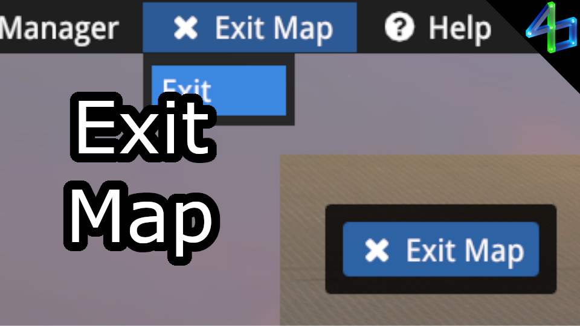

# Exit Map

If you want to leave a game, you currently need to do this through the pause menu. However, pausing also loads downloaded items (i.e. car skins when on a server), which can lag the game for a few seconds. This plugin lets you go back to the main menu, bypassing the pause menu.

